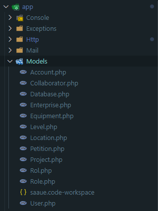
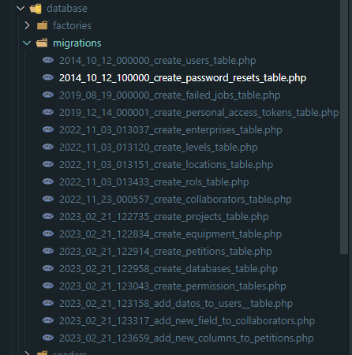
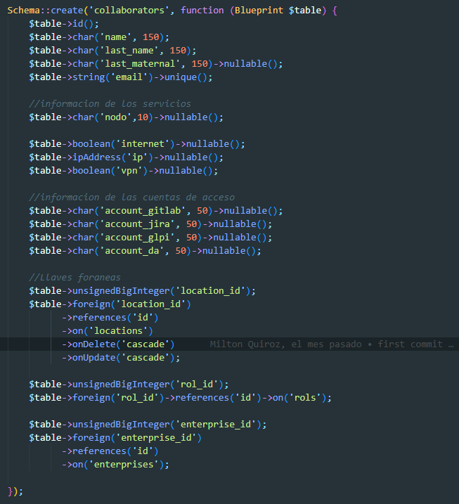
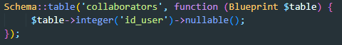

# Modelos 
Los modelos son las persepcion de los objetos en el proyecto, estos son exclusibamente para modelar  entidades que seran relevantes durante el desarrollo. Entre los ejemplos mas comunes encontramos a modelos como: Usuario, Conlaborador, Petición, etc.
Aqui hay una lista de los objetos utilizados en el proyecto que podras encontrar en la ruta relativa del proyecto: [`app\Models`](app\Models).



Estos modelos son creados principalmente para que tengan una coneccion directa con la aplicacion web, con esto mejoramos la modificacion en tiempo real de las aplicaciones. Por ejemplo para entrar en contexto, el modelo de `Collaborators.php` tiene la siguiente estructura: 
```php
<?php

namespace App\Models;

use Illuminate\Database\Eloquent\Factories\HasFactory;
use Illuminate\Database\Eloquent\Model;

class Collaborator extends Model
{
    use HasFactory;

    public $timestamps = false;

    protected $fillable = [
        'name',
        'last_name',
        'last_maternal',
        'email',
        'nodo',
        'internet',
        'ip',
        'vpn',
        'account_gitlab',
        'account_glpi',
        'account_jira',
        'account_da',
        'location_id',
        'rol_id',
        'enterprise_id',
        'id_user',
    ];

    public function location()
    {
        return $this->belongsTo(Location::class, 'location_id');
    }

    public function rol()
    {
        return $this->belongsTo(Rol::class,'rol_id');
    }

    public function enterprise()
    {
        return $this->belongsTo(Enterprise::class,'enterprise_id');
    }

}
```
De este codigo lo que mas nos intereza es el apartado de sus atributos:
```php
protected $fillable = [
        'name',
        'last_name',
        'last_maternal',
        'email',
        'nodo',
        'internet',
        'ip',
        'vpn',
        'account_gitlab',
        'account_glpi',
        'account_jira',
        'account_da',
        'location_id',
        'rol_id',
        'enterprise_id',
        'id_user',
    ];
```
Estos atributos estan relacionados con la base de datos, que dentro de laravel, los archivos encardados de hacer una correlación entre la base de datos y la aplicación con los modelos se llaman migraciones, las cuales se encuentran en la siguinte ruta relativa: `.\database\migrations`



Estas migraciones tiene la funcion de conectarse a la base de datos y actualizar los campos, la migración correspondiente a `Collaborators` son mas de un arhcivo:
- `database\migrations\2022_11_23_000557_create_collaborators_table.php`
- `database\migrations\2023_02_21_123317_add_new_field_to_collaborators.php`

Estos archivos estan sepados por una intervencion de lavel para poder hacer modificaciones sin borrar los datos existentes en la base de datos, ambos arhcivos en este ejemplo son codependientes, al momento de hacer una migración, y es una caracteristica de laravel al momento de crear migraciones:

Si exploramos los archivos vemos que en conjunto tienen los mimos campos que en el modelo son representrados como atriburos:

--- 

Archivo 2022_11_23_000557_create_collaborators_table.php:



---

Archvo 2023_02_21_123317_add_new_field_to_collaborators.php: 



<!-- EXC Report -->
Para poder entender mas de este aplicativo puedes revisar el apartado de [Creación y migración de modelos](./01_CreacionMigracionModelo/01_CreacionMigracionModelo.md)
<!-- EXC Report -->

Cuando los archivos estan viculado ahora podemos manipularlos dentro de los controladores pero antes de entrar en ese tema deberias poder indentificar las rutas:

[2. Rutas](../02_Rutas/02_Rutas.md)


