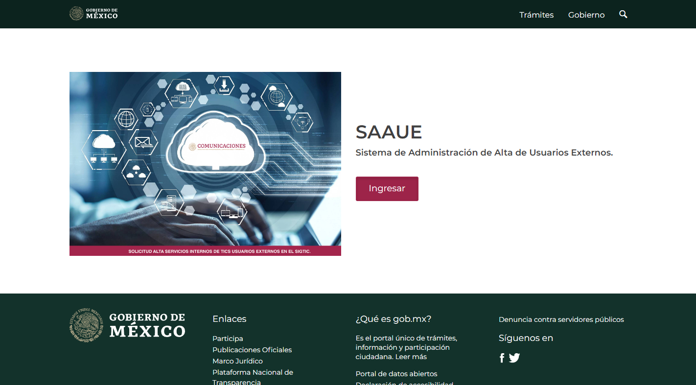

# Raiz del Arhivo '/'
Esta ruta hace referencia a una vista con extension `.blade.php`, para conecer mas de estas vistas puedes revisar la seccion de [Vistas en Laravel](../../03_Vistas/03_Vistas.md).

La vista es llamada directamente en la ruta:
```php
Route::get('/', function () {
    return view('welcome');
});
```
Esta vista se encuentra ubicada en la ruta relativa `.\resources\views\welcome.blade.php`, toda la ruta se acorta con la sentencia de `view()` en la ruta.

La vista tiene el siguiente diseño y es la utilizado como pagina inicial antes de logearse:




