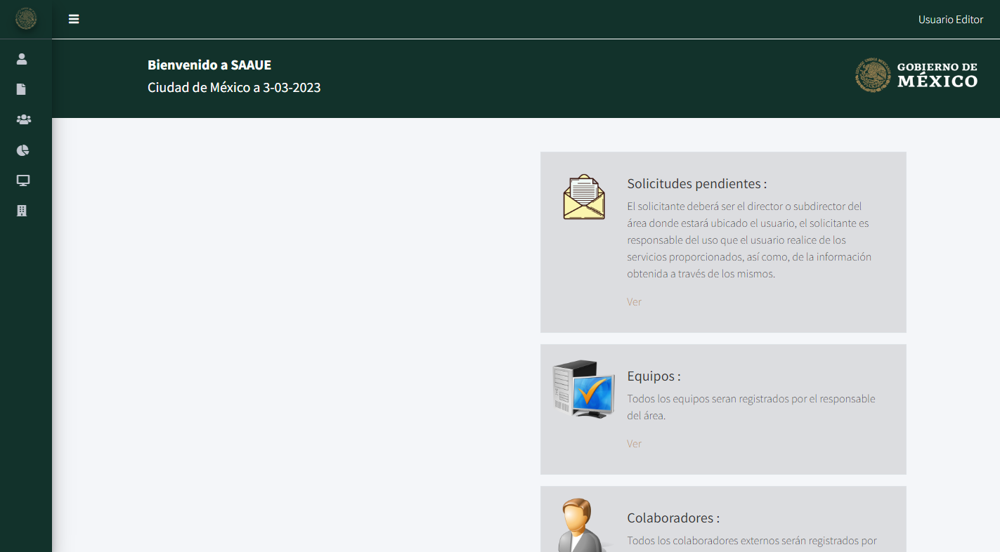

# Dashboard 
La ruta del dashboard esta definida en el arhivo ``, esta ruta hace referencia directamente en un metodo interno a la vista y a su vez esta restringido a un middleware:
```php
Route::get('/dashboard', function () {
    return view('dashboard');
})->middleware(['auth', 'verified'])->name('dashboard');

Route::get('dashboard', [DashboardController::class, 'index']);
```
La ruta se le coloco un identificador unico con el nombre de `dashboard`.




