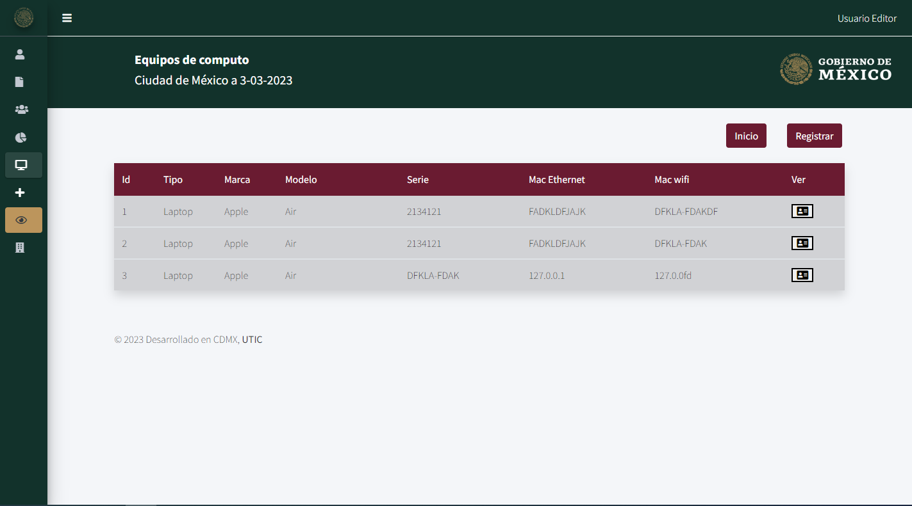
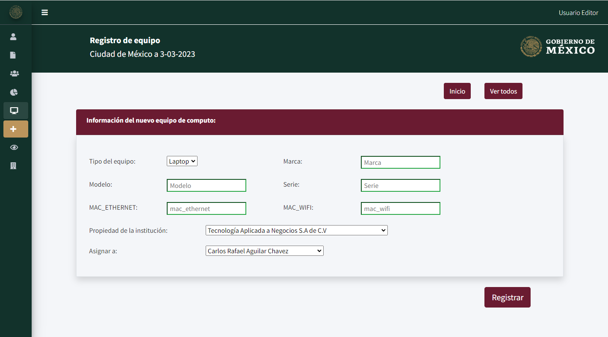
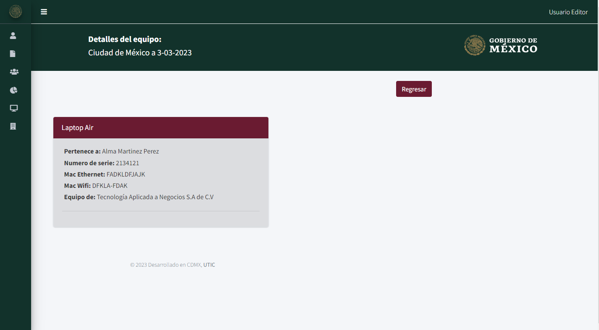

# Equipos

Esta ruta hace referencia al controlador de `EquipmentController`:
```php
Route::resource('equipment', EquipmentController::class);
```
Como vemos en la ruta se define que está correlacionado con las funciones que contiene el controlador, por lo que si accedemos a:
- `http://127.0.0.1:8000/equipment` hará el llamado a la función `index()`
- `http://127.0.0.1:8000/equipment/create` hará el llamado a la función `create()`

## Raiz [http://127.0.0.1:8000/equipment](`http://127.0.0.1:8000/equipment`)

El método restringe que solo los que sean `Externos` (en la base de datos tienen la restricción de un usuario de tipo 3), no pueden acceder a todos los equipos más de los que corresponden a sus propios colaboradores:  
```php
public function index(){
	if(auth()->user()->role_id != 3) {
    	$equipments = Equipment::all();
	} else{
    	$collaborators = Collaborator::where('id_user','=',auth()->user()->id)->get();
    	$equipments = [];
    	foreach($collaborators as $col){
        	$equipment = Equipment::where('collaborator_id','=',$col->id)->get();
        	$equipments = array_merge($equipments, $equipment->toArray());
    	}
	}
	return view('equipment/index', compact('equipments'));
}
```
La función retorna la vista como respuesta, esta vista está ubicada en `resources\views\equipment\index.blade.php`, la vista no se cargará si no contiene un arreglo con instancias de tipo `Equipment` que llamamos `$equipments`, y este es enviado como parámetro al momento de retornar:
```php
	return view('equipment/index', compact('equipments'));
```
La vista cargada correctamente tiene el siguiente diseño:


---

## Create ([http://127.0.0.1:8000/equipment/create](`http://127.0.0.1:8000/equipment/create`))

La etiqueta comúnmente definida en el archivo Blade puede ser definida de la siguiente manera:

```html
<a href="equipment/create"><button type="button" class="btn btn-secondary">Registrar</button></a>
```
Si accedemos a la ruta [http://127.0.0.1:8000/equipment/create](`http://127.0.0.1:8000/equipment/create`) se hará la llamada a la función:

```php
public function create(){
	auth()->user()->role_id == 3 ?  $collaborators = Collaborator::where('id_user','=',auth()->user()->id)->get() : $collaborators = Collaborator::all() ;
	$enterprises = Enterprise::all();
	$equipment = new Equipment();
	return view('equipment/create', compact('enterprises', 'enterprises'));
}
```
Esta función retorna la vista encontrada en `.\resources\views\equipment\create.blade.php` y como paramento enviamos dos arreglos `$enterprises` y `$enterprises`. La vista cargada correctamente tiene la siguiente respuesta en el navegador:



---

## Show
Para poder acceder a esta ruta es importante que se conozca los parámetros necesarios analizando su etiqueta:
```html
<a href="equipment/{{$equipment->id}}" alt="equipment"><button class="fas fa-address-card"></button></a>
```
Cuando se redirige a la siguiente ruta, se envía como parámetro el ID del equipo ya que este dato es utilizado en la función `show($id)`
```php
public function show($id){
	$collaborators = Collaborator::all();
	$equipment = Equipment::find($id);
	return view('equipment/show', compact('collaborators', 'equipment'));
}
```
Una vez cumplido con estos requisitos para obtener los parámetros siguientes se retornará la vista siguiente:


