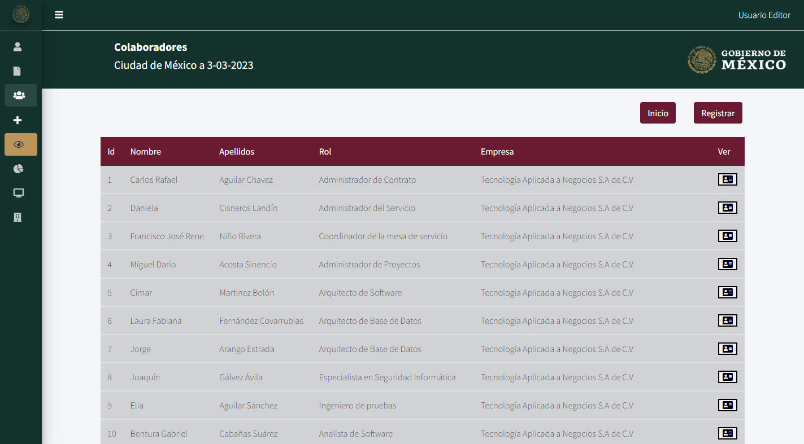

# Colaboradores

Las rutas de los colabores tiene diferentes llamados a distintos controladores:

```php
Route::resource('collaborator', CollaboratorController::class);
Route::resource('collaborator/petition', PetitionController::class);
Route::resource('collaborator/equipment', EquipmentController::class);
```
---

# Raiz

Esta ruta se acccesa principalmente por la ruta`http://127.0.0.1:8000/collaborator` y llama a la función `index()` en el controlador ``.\app\Http\Controllers\CollaboratorController.php`:

```php
public function index(){
    if(auth()->user()->role_id == 3 ){
        $collaborators     = Collaborator::where('id_user', auth()->user()->id)->get();
    }
    else{
        $collaborators = Collaborator::all();
    }

    return view('collaborator/index', compact('collaborators'));
}
```

Como vemos esta función restringe que solo los Externos (usuarios que tienen un permisos de tipo 3 en la base de datos), no pueden acceder mas que a los colaboradores que tenga o halla registrado el usuario, los Administradores y Editores (usuarios que tienen un permisos de tipo 1 o 2 respesctivamente en la base de datos), pueden visualizar todos los colaboradores en el sistema.
Si la funcion concluye correctamente se visualizara la siguiente vista:




