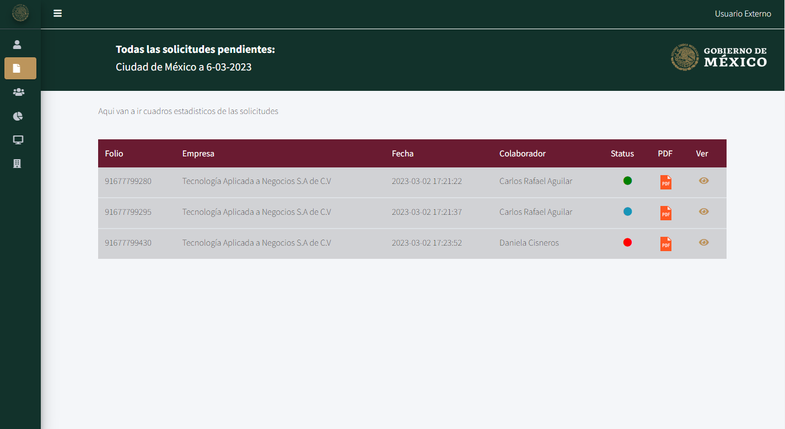
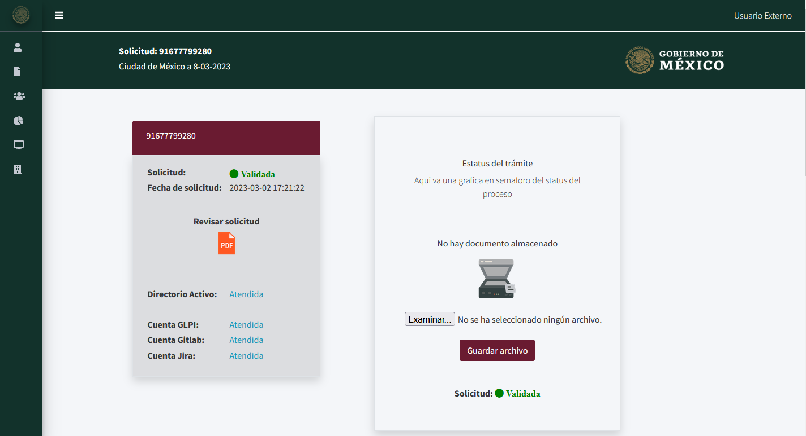
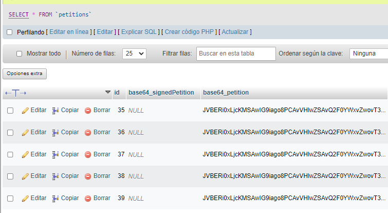

# Solicitudes

Las solicitudes en el proyecto tiene como correspondiente una realcion a su definicion en ingles "Petitions", todo en esta sección esta relacionado con la solicitudes que los Externos generan:

```php
Route::resource('petition', PetitionController::class);
Route::get('petition/{petition}', [PetitionController::class,'showPetition']);
Route::get('petition/{petition}/{FileID}', [PetitionController::class, 'showPDF']);
Route::get('petition/{petition}/{FileID}/sendEmail', [PetitionController::class, 'sendEmail']);
Route::get('petition/{petition}/{FileID}/sign', [PetitionController::class, 'showPDFSign']);
Route::get('petition/{petition}/{FileID}/validation', [PetitionController::class, 'validationPetition']);
```
---

## Raiz `http://127.0.0.1:8000/petition`

`Route::resource('petition', PetitionController::class);`

La ruta raiz en su definicion nos indica que tiene una relacion con las funciones del controlador, por lo que al moento de ingresar a esa ruta se hara un llamado a la función de de `index()`. Esta función realiza una busqueda de las solicitudes relacionada con el tipo de usuario, si es un usuario Externo (Tipo 3), retornara solo las solicitudes que tengan su ID, el ID fue cargado al momento de generar la Solicitud. Si es un usuario Administrador o Editor, consultara todas las solicitudes en el sistema:

```php 
public function index(){
    if(auth()->user()->role_id == 3){
        $petitions = Petition::where('user_id','=', auth()->user()->id)->get();
    }
    else{
        $petitions = Petition::all();
    }
    return view('petitions/index', compact('petitions'));
}
```

Si no existe ningun inconveniente se retornara la vista siguiente con un parametro `petitions` que es un arreglo de objetos con el Modelo de `Petitions`.



---

## Ruta: `http://127.0.0.1:8000/petition/{petition}`
```php
Route::get('petition/{petition}',[PetitionController::class,'showPetition']);
```
Esta ruta solo puede ser accedida si se cumple con el paramtro existente, como vemos en su definición. La función que es llamada se encuentra en el controlador `PetitionController` y tiene como nombre `showPetition($id)`
```php
public function showPetition($id){
    $equipments   = Equipment::all();
    $petition     = Petition::find($id);
    $collaborator = Collaborator::find($id);
    $this->verifyStatus($petition);

    return view('collaborator/petition/showPetition', compact('petition', 'collaborator', 'equipments'));
}

```
La función pide como parametro una variable llamada `$id` que es la valor de identificación definida en la base de datos, y a su vez tambien busca al colaborador, Se puede hacer referencia a esta ruta con la siguiente etiqueta: 
```html
<a href="/petition/{{ $petition->id }}" alt="ver" class="col-md-1 fas fa-eye"></a>
```
Si todo sale correcatamte debearia salir la siguiente vista:



Esta vista se encuentra en la ruta relativa del proyecto: `resources\views\collaborator\petition\showPetition.blade.php`

---

## Ruta visualizador de PDF's: `petition/{petition}/{FileID}`
```php
Route::get('petition/{petition}/{FileID}', [PetitionController::class, 'showPDF']);
```
La ruta anterior correspndende a la visualización del pdf, esta ruta la usaremos para poder hacer una peticion para poder usar un vusualizador por defecto de una dependencia llamada DomPDF, si revisamos el controlador con la función `showPDF($petition,$FileID)`

Esta funcion puede ser llamada de la siguiente forma en blade:
```html
<a href="/petition/{{ $petition->id }}/{{ $petition->fileID }}" target="_blank"></a>
```

```php
public function showPDF($id, $FileID){
    $petition = Petition::find($id);
    $pdfContent = base64_decode($petition->base64_petition);
    $pdf_name = $FileID.'.pdf';
    file_put_contents(storage_path('pdf/'.$pdf_name), $pdfContent);
    return response()->file(storage_path('pdf/' . $FileID . '.pdf'));
}
```
La función lo que realiza es tomar la cadena en Base64 (La base 64 es un sistema de codificación que se utiliza para convertir datos binarios como archivos de imagen, video o audio en texto legible y transportable), lo decodficamos y lo almacenamos en la ruta relativa del proyecto `storage\pdf` y posterior mente lo visualizamos en el navegador con la sentencia `response()->file(storage_path('pdf/' . $FileID . '.pdf')`. La razon por la que se abre en una nueva ventana es porque en el link del archivo blade especificamos esta acción con la extensión `target="_blank"`:
```html
<a href="/petition/{{ $petition->id }}/{{ $petition->fileID }}" target="_blank"></a>
```
Si no se tiene ningun error se debe visualizar como la siguiente imagen:


Para que pueda visualizarse en la base de datos ya debe estar registrada esta cadena en el campo `base64_petition`:



## Enviar Correo:

```php
Route::get('petition/{petition}/{FileID}/sendEmail', [PetitionController::class, 'sendEmail']);
```
Para esta de igual se utiliza para poder ejecutar una funcionalida, el controlador hace el llamado a la función `sendEmail($petition,FileID)` y tiene como parametro el identicador de la peticion y la identificación del colaborador:
```php
public function sendEmail($petition_id,$collaborator_id){
    $collaborator = Collaborator::find($collaborator_id);
    $petition     = Petition::find($petition_id);
    $equipments   = Equipment::all();

    $maildata = [
        'title' => 'Solicitud de Servicios SICT',
    ];

    Mail::to(auth()->user()->email)->send(new PetitionAcceptedMailable($maildata));
    Mail::to($collaborator->email)->send(new PetitionAcceptedMailable($maildata));

    return back()->withInput()->with('mensaje', 'Enviado');

}
```
La función realiza una busqueda de los datos para poder generar un correo, los correos son enviados al usuario logeado y al colaborador que previamente ya estan registrados con los correos electronicos corrrespondientes. Antes de ejecutar esta función es necesario verificar que se cumplan ciertas condiciones:
1. Primero que nada se debe domificar el archivo `.env` en la raiz del proyecto dentro del proyecto y colocar el correo con los permisos permitido que servira como emisor de los correos:
```js
MAIL_MAILER=smtp
MAIL_HOST=localhost
MAIL_PORT=1025
MAIL_USERNAME=null
MAIL_PASSWORD=null
MAIL_ENCRYPTION=null
MAIL_FROM_ADDRESS=sict@gob.mx
MAIL_FROM_NAME="SICT"
```
Esta configuración corresponde a una herramienta llamada MailHog que se utiliza para la depuración, el desarrollo y la prueba de aplicaciones que envían correos electrónicos. 
En este mismo proyecto se encuentra un ejecutable `dev\MailHog_windows_amd64.exe` que al presionar dos veces ejecutara dicha herramienta. Si necesitas mas información puedes consultar su repositorio en [MailHog](https://github.com/mailhog/MailHog).


