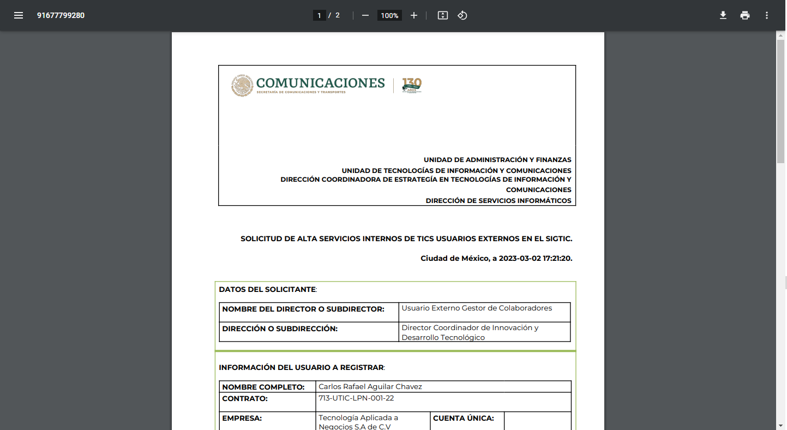

# Solicitudes 
  
Las solicitudes en el proyecto tienen como correspondiente una relación a su definición en inglés "Petitions", todo en esta sección está relacionado con las solicitudes que los Externos generan: 

```php 
Route::resource('petition', PetitionController::class); 
Route::get('petition/{petition}', [PetitionController::class,'showPetition']); 
Route::get('petition/{petition}/{FileID}', [PetitionController::class, 'showPDF']); 
Route::get('petition/{petition}/{FileID}/sendEmail', [PetitionController::class, 'sendEmail']); 
Route::get('petition/{petition}/{FileID}/sign', [PetitionController::class, 'showPDFSign']); 
Route::get('petition/{petition}/{FileID}/validation', [PetitionController::class, 'validationPetition']); 
Route::post('petition/{petition}', [PetitionController::class, 'updateFile'])->name('petition.updateFile'); 
``` 
--- 
 
 
## Raíz `http://127.0.0.1:8000/petition` 
 
 
`Route::resource('petition', PetitionController::class);` 
 
La ruta raíz en su definición nos indica que tiene una relación con las funciones del controlador, por lo que al momento de ingresar a esa ruta se hará un llamado a la función de `index()`. Esta función realiza una búsqueda de las solicitudes relacionada con el tipo de usuario, si es un usuario Externo (Tipo 3), retornara solo las solicitudes que tengan su ID, el ID fue cargado al momento de generar la Solicitud. Si es un usuario Administrador o Editor, consultará todas las solicitudes en el sistema: 
 
```php  
public function index(){ 
    if(auth()->user()->role_id == 3){ 
        $petitions = Petition::where('user_id','=', auth()->user()->id)->get(); 
    } 
    else{ 
        $petitions = Petition::all(); 
    } 
    return view('petitions/index', compact('petitions')); 
} 
``` 
 
 
Si no existe ningún inconveniente se retornará la vista siguiente con un parámetro `petitions` que es un arreglo de objetos con el Modelo de `Petitions`. 
 
 
 
 
 
--- 
 
 
## Ruta: `http://127.0.0.1:8000/petition/{petition}` 
```php 
Route::get('petition/{petition}',[PetitionController::class,'showPetition']); 
``` 
Esta ruta solo puede ser accedida si se cumple con el parámetro existente, como vemos en su definición. La función que es llamada se encuentra en el controlador `PetitionController` y tiene como nombre `showPetition($id)` 
```php 
public function showPetition($id){ 
    $equipments   = Equipment::all(); 
    $petition     = Petition::find($id); 
    $collaborator = Collaborator::find($id); 
    $this->verifyStatus($petition); 
 
 
    return view('collaborator/petition/showPetition', compact('petition', 'collaborator', 'equipments')); 
} 
 
 
``` 
La función pide como parámetro una variable llamada `$id` que es el valor de identificación definida en la base de datos, y a su vez también busca al colaborador, Se puede hacer referencia a esta ruta con la siguiente etiqueta:  
```html 
<a href="/petition/{{ $petition->id }}" alt="ver" class="col-md-1 fas fa-eye"></a> 
``` 
Si todo sale correctamente debería salir la siguiente vista: 
 
 
 
 
 
Esta vista se encuentra en la ruta relativa del proyecto: `resources\views\collaborator\petition\showPetition.blade.php` 
 
 
--- 
 
 
## Ruta visualizador de PDF's: `petition/{petition}/{FileID}` 
```php 
Route::get('petition/{petition}/{FileID}', [PetitionController::class, 'showPDF']); 
``` 
La ruta anterior corresponde a la visualización del pdf, esta ruta la usaremos para poder hacer una solicitud para poder usar un visualizador por defecto de una dependencia llamada DomPDF, si revisamos el controlador con la función `showPDF($petition,$FileID)` 
 
 
Esta función puede ser llamada de la siguiente forma en blade: 
```html 
<a href="/petition/{{ $petition->id }}/{{ $petition->fileID }}" target="_blank"></a> 
``` 
 
 
```php 
public function showPDF($id, $FileID){ 
    $petition = Petition::find($id); 
    $pdfContent = base64_decode($petition->base64_petition); 
    $pdf_name = $FileID.'.pdf'; 
    file_put_contents(storage_path('pdf/'.$pdf_name), $pdfContent); 
    return response()->file(storage_path('pdf/' . $FileID . '.pdf')); 
} 
``` 
La función lo que realiza es tomar la cadena en Base64 (La base 64 es un sistema de codificación que se utiliza para convertir datos binarios como archivos de imagen, video o audio en texto legible y transportable), lo decodificamos y lo almacenamos en la ruta relativa del proyecto `storage\pdf` y posteriormente lo visualizamos en el navegador con la sentencia `response()->file(storage_path('pdf/' . $FileID . '.pdf')`. La razón por la que se abre en una nueva ventana es porque en el link del archivo blade especificamos esta acción con la extensión `target="_blank"`: 
```html 
<a href="/petition/{{ $petition->id }}/{{ $petition->fileID }}" target="_blank"></a> 
``` 
Si no se tiene ningún error se debe visualizar como la siguiente imagen: 
 
 
 
 
 
Para que pueda visualizarse en la base de datos ya debe estar registrada esta cadena en el campo `base64_petition`: 
 
 
 
 
 
## Ruta para enviar correo: `petition/{petition}/{FileID}/sendEmail` 
 
 
```php 
Route::get('petition/{petition}/{FileID}/sendEmail', [PetitionController::class, 'sendEmail']); 
``` 
Para esta de igual se utiliza para poder ejecutar una funcionalidad, el controlador hace el llamado a la función `sendEmail($petition,FileID)` y tiene como parámetro el identificador de la solicitud y la identificación del colaborador: 
```php 
public function sendEmail($petition_id,$collaborator_id){ 
    $collaborator = Collaborator::find($collaborator_id); 
    $petition     = Petition::find($petition_id); 
    $equipments   = Equipment::all(); 
 
 
    $maildata = [ 
        'title' => 'Solicitud de Servicios SICT', 
    ]; 
 
 
    Mail::to(auth()->user()->email)->send(new PetitionAcceptedMailable($maildata)); 
    Mail::to($collaborator->email)->send(new PetitionAcceptedMailable($maildata)); 
 
 
    return back()->withInput()->with('mensaje', 'Enviado'); 
 
 
} 
``` 
La función realiza una búsqueda de los datos para poder generar un correo, los correos son enviados al usuario logueado y al colaborador que previamente ya están registrados con los correos electrónicos correspondientes. Antes de ejecutar esta función es necesario verificar que se cumplan ciertas condiciones: 
1. Primero que nada se debe modificar el archivo `.env` en la raíz del proyecto dentro del proyecto y colocar el correo con los permisos permitido que servirá como emisor de los correos: 
```js 
MAIL_MAILER=smtp 
MAIL_HOST=localhost 
MAIL_PORT=1025 
MAIL_USERNAME=null 
MAIL_PASSWORD=null 
MAIL_ENCRYPTION=null 
MAIL_FROM_ADDRESS=sict@gob.mx 
MAIL_FROM_NAME="SICT" 
``` 
Esta configuración corresponde a una herramienta llamada MailHog que se utiliza para la depuración, el desarrollo y la prueba de aplicaciones que envían correos electrónicos.  
En este mismo proyecto se encuentra un ejecutable `dev\MailHog_windows_amd64.exe` que al presionar dos veces ejecutara dicha herramienta. Si necesitas más información puedes consultar su repositorio en [MailHog](https://github.com/mailhog/MailHog). 
 
 
Al ejecutar el archivo `.exe` se desplegará una terminal que indicará los procesos que identifica la herramienta: 
 
 
 
 
 
Y para poder ver las respuestas debes estar en la ruta `http://localhost:8025/`: 
 
 
 
 
 
En este portal podrás ver cómo se visualizará el correo que enviarías al colaborador y al usuario externo en sus correos personales: 
 
 
 
 
 
Nota: Esta opción es solo para hacer pruebas y para poder usarlo en producción es necesario tener un correo electrónico SMTP con permisos autorizados para que sea manipulado con la plataforma. 
 
 
Una vez se cumplan estos requisitos podemos hacer ver que en la función, se envían dos correos, uno para el usuario que hizo la solicitud y otro para el colaborador requiere los permisos. 
 
 
```php 
public function sendEmail($petition_id,$collaborator_id){ 
    $collaborator = Collaborator::find($collaborator_id); 
    $petition     = Petition::find($petition_id); 
    $equipments   = Equipment::all(); 
 
 
    $maildata = [ 
        'title' => 'Solicitud de Servicios SICT', 
    ]; 
 
 
    Mail::to(auth()->user()->email)->send(new PetitionAcceptedMailable($maildata)); 
    Mail::to($collaborator->email)->send(new PetitionAcceptedMailable($maildata)); 
 
 
    return back()->withInput()->with('mensaje', 'Enviado'); 
 
 
} 
``` 
Para realizar él envió del correo se consulta a un archivo Mailable que se encuentra en la ruta relativa `app\Mail\PetitionAcceptedMailable.php`.  
 
 
--- 
 
 
**Nota:** Para crear un archivo de este tipo, es necesario ejecutar en la terminal el siguiente comando:  
 
 
```bash 
php artisan make:mail NombreDelArchivoMailable 
``` 
 
 
--- 
En el archivo `` es importante analizar los siguientes elementos: 
 
 
- Para recibir la información enviada 
 
 
```php 
public $maildata; 
``` 
- Método constructor con la información que se desea manipular en la vista: 
```php 
public function __construct($maildata) 
{ 
    $this->maildata = $maildata; 
} 
``` 
- Función que retorna la ruta con la imagen en este caso la vista que se mostrará en el correo se encuentra en `resources\views\petitions\emails\petitionAccepted.blade.php`, con la notación siguiente se puede reducir el tamaño de la ruta: 
```php 
public function content() 
{ 
    return new Content( 
        view: 'petitions.emails.petitionAccepted' 
    ); 
} 
``` 
Si el correo se genera correctamente, podemos verificar en MailHog la siguiente vista o una variante: 
 
 
 
 
 
Como extra en la función dentro del controlador de Peticiones/Solicitudes. 
```php 
public function sendEmail($petition_id,$collaborator_id){ 
    $collaborator = Collaborator::find($collaborator_id); 
    $petition     = Petition::find($petition_id); 
    $equipments   = Equipment::all(); 
 
 
    $maildata = [ 
        'title' => 'Solicitud de Servicios SICT', 
    ]; 
 
 
    Mail::to(auth()->user()->email)->send(new PetitionAcceptedMailable($maildata)); 
    Mail::to($collaborator->email)->send(new PetitionAcceptedMailable($maildata)); 
 
 
    return back()->withInput()->with('mensaje', 'Enviado'); 
 
 
} 
``` 
Al retornar la respuesta la definición `back()->withInput()->with('mensaje', 'Enviado')` regresa a la vista que hizo la solicitud, sin la necesidad de hacer una búsqueda nuevamente de los parámetros para poder visualizar alguna vista. 
## Ruta para subir petición firmada `petition/{petition}/{FileID}/sign` 
Esta ruta tiene como objetivo visualizar los archivos de tipo pdf, más específico las solicitudes con las firmas de los solicitantes externos: 
```php 
Route::get('petition/{petition}/{FileID}/sign', [PetitionController::class, 'showPDFSign']); 
``` 
 
 
La llamada a los archivos es con una etiqueta de este tipo: 
```html 
<a href="/petition/{{ $petition->id }}/{{$petition->fileID }}/sign" target="_blank"></a> 
``` 
La función que se llama tiene como nombre `showPDFSign($id, $FileID)` al entrar a esta ruta tiene como parámetros el id de la solicitud y el identificador que tendría la solicitud: 
```php 
public function showPDFSign($id, $FileID) 
{ 
 
 
    $petition = Petition::find($id); 
    $pdfContent = base64_decode($petition->base64_signedPetition); 
    $pdf_name = $FileID.'.pdf'; 
    file_put_contents(storage_path('pdf/'.$pdf_name), $pdfContent); 
    return response()->file(storage_path('pdf/' . $FileID . '.pdf')); 
} 
``` 
Esta función toma la cadena de la solicitud firmada y guardada en el sistema previamente en Base64 dentro de la base de datos. Decodifica la cadena `base64_decode($petition->base64_signedPetition);`y la almacena en esta ruta relativa del proyecto `storage\pdf` para que posteriormente se pueda visualizar en una nueva pestaña: 
 
 
 
 
 
## Ruta para validar una solicitud: `http://127.0.0.1:8000/petition/{petition}/{FileID}/validation` 
 
 
```php 
Route::get('petition/{petition}/{FileID}/validation', [PetitionController::class, 'validationPetition']); 
``` 
 
 
La llamada a esta función sólo tiene el objetivo de modificar el valor de la solicitud a "Validado". La función a la que hace referencia corresponde a la  
 
 
```php 
public function validationPetition($petition_id,$collaborator_id){ 
    $collaborator = Collaborator::find($collaborator_id); 
    $petition     = Petition::find($petition_id); 
 
 
    $petition->status = config('app.constants.VALIDADO'); 
    $petition->save(); 
    return back()->withInput()->with('mensaje', 'Ocurrió un error al procesar el formulario'); 
} 
``` 
 
 
En esta función aparece un constante que no se encuentra definida en el controlador `config('app.constants.VALIDADO')` esta constante está definida en: `config\app.php` 
```php 
'constants' => [ 
    'PENDIENTE' => 0, 
    'EN_PROCESO' => 1, 
    'ATENDIDO' => 2, 
    'VALIDADO' => 3, 
], 
``` 
Estas constantes pueden ser usadas en todo el proyecto. Y también puedes usar esta definición para poder definir nuevas constantes globales. 
 
 
## Ruta para actualizar actualizar PDF `'petition/{petition}` con el nombre de la ruta `petition.updateFile` 
```php 
Route::post('petition/{petition}', [PetitionController::class, 'updateFile'])->name('petition.updateFile'); 
``` 
 
 
Este tipo de rutas tiene la característica de que hacen referencia una misma ruta que hemos definido anteriormente: 
```php 
Route::get('petition/{petition}', [PetitionController::class,'showPetition']); 
``` 
Esta ruta cumple con ciertas características extras que cambian totalmente la propiedad de la ruta y hace a ambas totalmente distintas. 
La primera diferencia es que la ruta que estamos analizando es diferente ya que es de tipo POST para enviar datos del formulario. Y la segunda característica es que tiene un identificador con el nombre `petition.updateFile`, por lo que solo puede ser utilizado dentro de un formulario como el siguiente: 
```html 
<form action="{{ route('petition.updateFile', $petition->id) }}" method="POST" enctype="multipart/form-data"> 
    @csrf 
    <!--Etiquetas --> 
</form> 
``` 
La definición de @csrf significa "Cross-Site Request Forgery" (falsificación de petición en sitios cruzados). Esto es importante ya que es una medida de seguridad en aplicaciones para generar valores aleatorios generados por el servidor y que se incluyen en los formularios y solicitudes HTTP.  
 
 
La ruta hace un llamado a la función de `updateFile(Request $request, $id)`: 
 
 
```php 
public function updateFile(Request $request, $id) 
{ 
    $equipment = Equipment::all(); 
    $collaborator = Collaborator::find($id); 
    $petition = Petition::findOrFail($id); 
    $archivo = $request->file('archivo'); 
 
 
    if($archivo != null){ 
        $request->validate([ 
        'archivo' => 'required|file|mimes:pdf|max:4096', 
            ]); 
        $fileName = $petition->fileID."_sign.pdf"; 
 
 
        $archivo->storeAs('', $fileName,'public'); 
 
 
        $pdfCreated = storage_path('app/public/'.$fileName); 
        $pdfContent = file_get_contents($pdfCreated); 
        $pdfBase64 = base64_encode($pdfContent); 
        $petition->base64_signedPetition = $pdfBase64; 
        $petition->save(); 
    } 
 
 
    return view('collaborator/petition/showPetition', compact('petition', 'collaborator')); 
} 
``` 
Esta función recibe un valor de formulario de tipo file: 
```html 
<input type="file" name="archivo"> 
``` 
y es analizado para que se almacene, estos archivos pueden ser filtrados en esta sección, primero que nada, valida si el campo está vacío, de lo contrario valida que el archivo sea de tipo PDF y tenga un tamaño menor a 4 MB, una vez cumplido esto, se almacena el archivo en la ruta relativa del proyecto `public\storage`, una vez almacenado posteriormente lo convertimos a una cadena de tipo base64 y es almacenado en el campo `base64_signedPetition` de la base de datos. 
 
 
 
 
 
Retornando la vista a la visualización de la Petición/Solicitud. Esto es para que cumpla con ciertas alertas si el archivo no cumple con las características: 
```html 
@include('sweetalert::alert') 
 
 
@if ($errors->any()) 
    <div class="alert alert-danger"> 
        <ul> 
            @foreach ($errors->all() as $error) 
                <li>{{ $error }}</li> 
            @endforeach 
        </ul> 
    </div> 
@endif 
```
