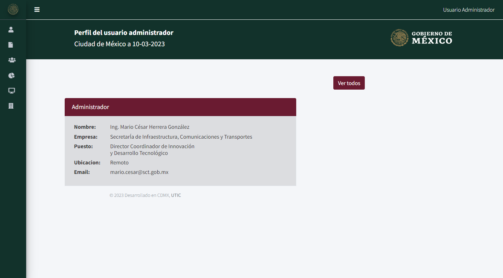

# Rutas de User 
```php 
Route::resource('user', UserController::class)->middleware('admin'); 
``` 
Esta sección es única de los administradores, dado que esta sección es para poder registrar, consultar y eliminar a los usuarios. Por esa razón está restringido con un middleware que podemos encontrar en la ruta relativa del proyecto: `app\Http\Middleware\AdminMiddleware.php` 
  
Con esto podemos verificar que la restricción tiene la siguiente definición: 
```php 
public function handle(Request $request, Closure $next) 
{ 
	if (auth()->user()->role_id === 1) { 
    	return $next($request); 
	} 
  
	return redirect('/dashboard')->with('error', 'No tienes permiso para acceder a esta página.'); 
} 
``` 
  
La razón por la que se define como `admin` en el middleware es que se define su nombre en el arreglo `protected $routeMiddleware = [ ... ];` en la ruta relativa del Kernel `app\Http\Kernel.php`: 
```php 
protected $routeMiddleware = [ 
	..., 
	'admin' => \App\Http\Middleware\AdminMiddleware::class, 
]; 
``` 
  
La misma ruta está definida como `resource` por lo que esta ruta tiene relación con las funciones en el controlador `UserController`, por lo que la ruta raíz es de esta ruta llama a la función de `index()`. 
  
## Ruta Raíz (`http://127.0.0.1:8000/user`) 
  
La ruta raíz hace un llamado a la función de `index()` en el controlador de `UserController.php` en la ruta relativa `app\Http\Controllers\UserController.php`: 
```php 
public function index() 
{ 
	$users = User::all(); 
	return view('user/index', compact('users')); 
} 
``` 
Como la función solo está permitida para los administradores, no es necesario restringirla con un identificador de autentificación (`auth()->user()`), por lo que muestra todos los usuarios y los envía como parámetro a la vista ubicada en la ruta relativa del proyecto `resources\views\user\index.blade.php` 
  
 
  
## Ruta de visualización de datos del usuario (`http://127.0.0.1:8000/user/1`) 
  
En esta ruta corresponde a una ruta dentro de la vista de `index.blade.php` en esta vista existe una etiqueta que direcciona a la función correspondiente: 
  
```html 
<a href="/user/{{$user->id}}" alt="Perfil" > 
	<button class="fas fa-address-card"></button> 
</a> 
``` 
Esta definición llama a la función `show($id)`, esta función tiene como parámetro el id del usuario al que se quiere consultar y con este se obtiene toda la información de la base de datos y lo pasamos de parámetro a la vista con `compact()`: 
```php 
public function show($id) 
{ 
	$user = User::find($id); 
	return view('user/show', compact('user')); 
} 
``` 
Y retorna la vista ubicada en `resources\views\user\show.blade.php`: 
 
  
## Ruta de registros de usuario (`http://127.0.0.1:8000/user/create`) 
  
En esta ruta relacionada con la función `create()`, por lo que no necesita ningún parámetro: 
```php 
public function create() 
{ 
	$enterprises   = Enterprise::all(); 
	$locations 	= Location::all(); 
	$roles     	= Role::all(); 
	$rols      	= Rol::all(); 
  
  
	return view('user/create', compact('enterprises','locations','roles','rols')); 
} 
``` 
Primero que nada, consulta los datos requeridos para poder generar el formulario correctamente y los pasa como parámetros a la vista con `compact()`: 
  
 
  
# Ruta de registro de usuarios 
Para poder almacenar los datos que se registre para el nuevo usuario de la vista en la ruta `http://127.0.0.1:8000/user/create`  
```html 
<form method="POST" action="{{route('user.store')}}"> 
@csrf 
<!--Etiquetas--> 
	<input class="btn btn-secondary btn-lg active" type="submit" value="Registrar"> 
<!--Etiquetas--> 
</form> 
``` 
Con el formulario anterior podernos consultar la función `store(Request $request)` correspondiente en el controlador `app\Http\Controllers\UserController.php`: 
```php 
public function store (Request $request) 
{ 
  
	$user = new User(); 
  
	$user->name           	= $request->name; 
	$user->last_name      	= $request->last_name; 
	$user->last_maternal  	= $request->last_maternal; 
	$user->email          	= $request->email; 
	$user->role_id        	= $request->role_id; 
	$user->password       	= Hash::make($request->password); 
	$user->enterprise_id  	= $request->enterprise_id; 
	$user->rol_id         	= $request->rol_id; 
	$user->location_id    	= $request->location_id; 
  
  
	$user->save(); 
  
	$users = User::all(); 
  
	return view('user/index', compact('users')); 
} 
``` 
Esta función almacena la información introducida en el cuestionario y la guarda en la base de datos, una vez almacenada se retorna a la vista raíz. 
