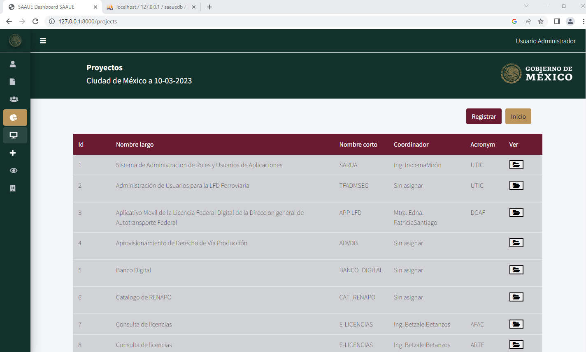
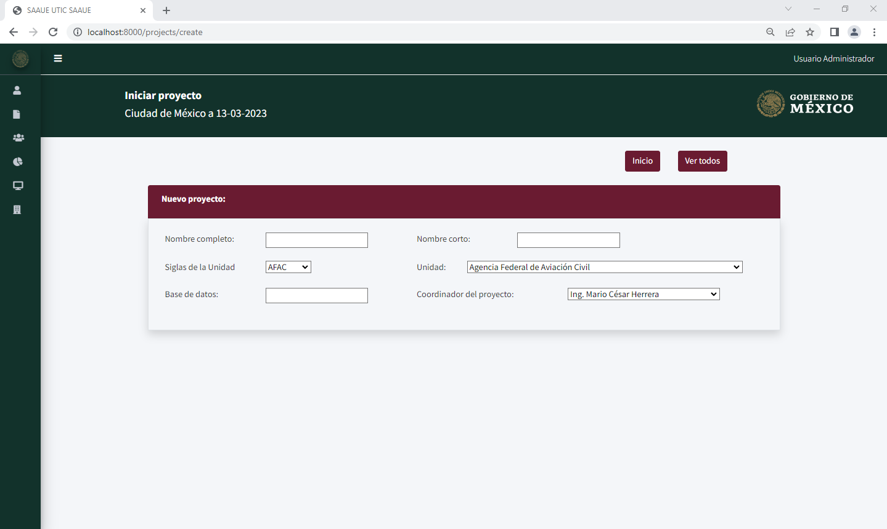
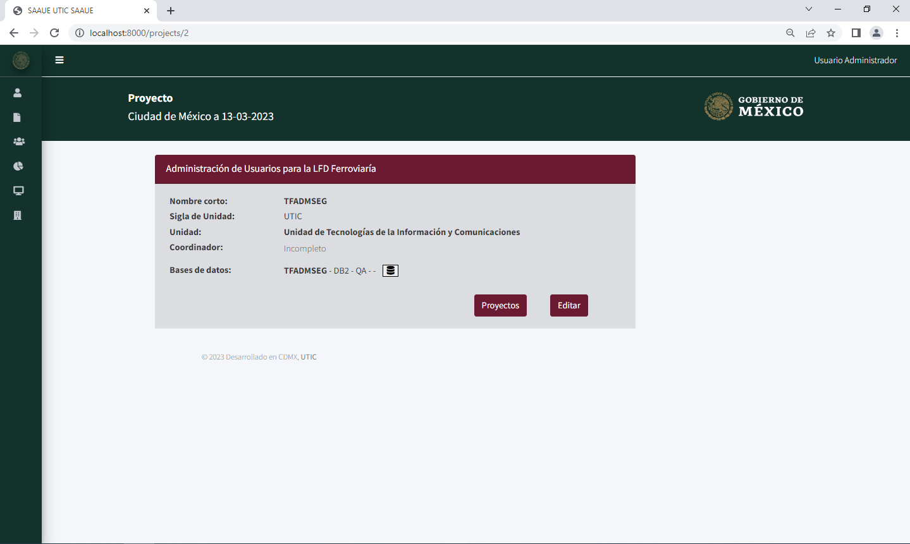

# Ruta de proyectos 
```php 
Route::resource('projects', ProjectController::class); 
``` 
Esta ruta tiene una relación a las funciones definidas en el controlador de `app\Http\Controllers\ProjectController.php`. Por lo que la función `index()` corresponde a la raíz del proyecto. 
  
## Ruta raíz 
```php 
public function index() 
{ 
	$users	= User::all(); 
	$projects = Project::all(); 
	return view('projects/index', compact('projects','users')); 
} 
``` 
En esta función principalmente consulta todos los registros en usuarios y proyectos de la base de datos, haciendo referencia a los modelos para enviarlos por parámetros. Posteriormente retorna la vista en `resources\views\projects\index.blade.php`:

 


## Ruta para registrar proyecto
Pa registrar un proyecto tenemos que acceder en el navegador a la ruta [http://localhost:8000/projects/create](http://localhost:8000/projects/create), esta ruta llamara a la funcion `create()` en el controlador `ProjectController.php`:

```php
public function create()
{

    $collaborators = Collaborator::all();
    $enterprises = Enterprise::all();
    $databases = Database::all();
    $users = User::all();

    $project = new Project();
    return view('projects/create', compact('collaborators', 'enterprises', 'users', 'databases' ));
}
```
Esta función retorna una vista de un formulario y para que la vista se complemente se necesita obtener los datos de los colaboradores registrados, las empresas y las bases de datos. Si la vista cumple las condiciones, se visualizara la siguiente vista:



## Ruta para visualizar informacion del proyecto
Para poder visualizar la informacion de algun proyecto es necesario acceder a la ruta [http://localhost:8000/projects/{project_id}](http://localhost:8000/projects/{project_id}/), el campo `project_id` es un campo de tipo numerico unico que se necesitara la función para poder retornar la vista:

```php
public function show($id)
{
    $user = User::find($id);
    $project = Project::find($id);
    $databases = Database::all();
    $databasesid = Database::where('project_id', $id)->get(['id', 'name', 'dbms', 'so','criticality', 'enviroment','ip','port','project_id']);
    return view('projects/show', compact('project','user','databases','databasesid'));
}
```
Esa función consulta los datos de los usuarios, los proyectos, las bases de datos y las bases de datos que complan una relacion con el id del proyecto. Si se cumplen con los requerimientos se podra visualizar una vista parecida a esta:




