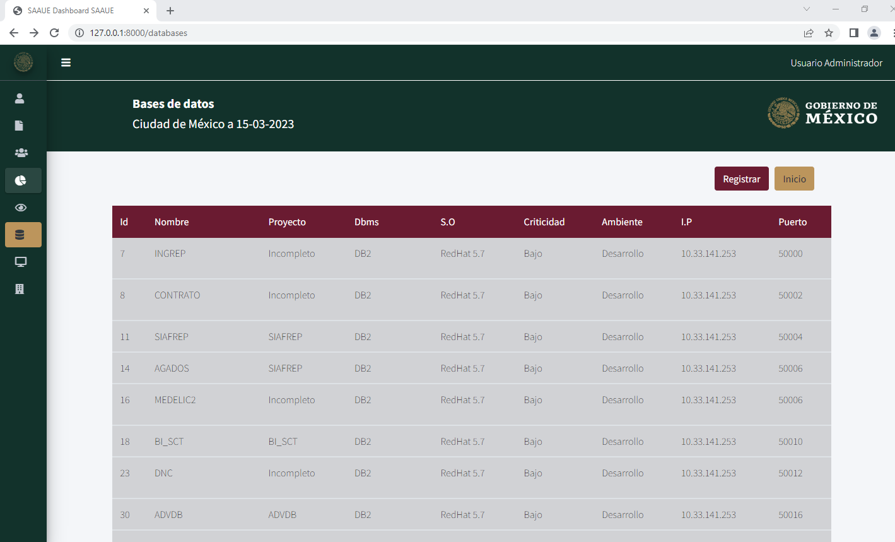

# Rutas de Based de datos
```php
Route::resource('databases', DatabaseController::class);
```
La ruta al estar definida como  `resource` se comprende que la rutas estan correlacionada con las funciones, por lo que la ruta `http://127.0.0.1:8000/databases` corresponde con la la función `ìndex()` en el controlador `app\Http\Controllers\DatabaseController.php`:
``
```php
public function index()
{
    $projects = Project::all();
    $databases =   Database::all();
    return view('databases/index', compact('databases', 'projects'));
}
```
La función mustra todas las bases de datos y proyectos para poder correlacionarlo con la tabla:




