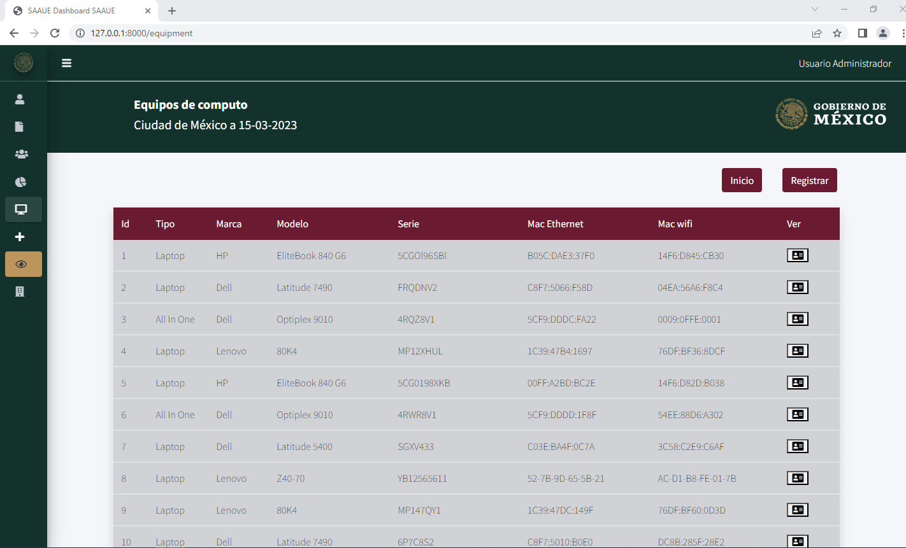

# Rutas de Equipos
```php
Route::resource('enterprise', EnterpriseController::class);
```

La ruta al estar definida como resource hace referencia a que la ruta esta relacionada con las funciones. Por lo que la ruta `http://127.0.0.1:8000/equipment`, esta relacionada con la función `index()` en el controlador 

```php
public function index(){
    if(auth()->user()->role_id != 3) {
        $equipments = Equipment::all();
    } else{
        $collaborators = Collaborator::where('id_user','=',auth()->user()->id)->get();
        $equipments = [];
        foreach($collaborators as $col){
            $equipment = Equipment::where('collaborator_id','=',$col->id)->get();
            $equipments = array_merge($equipments, $equipment->toArray());
        }
    }
    return view('equipment/index', compact('equipments'));
}
```
En esta vista primero evalua si el usuario logueado es externo o no, si lo es, es solo mostrara los equipos que estan en a su cargo que son usadas por sus colaboradores y si es adminstrador o editor, mostrara todos los equipos registrados en la plataforma: 



---

## Ruta de registro `http://127.0.0.1:8000/equipment/create`

